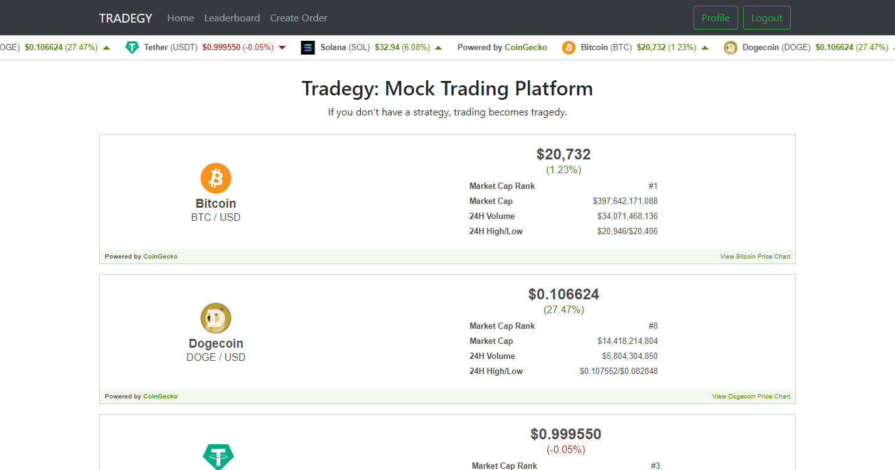
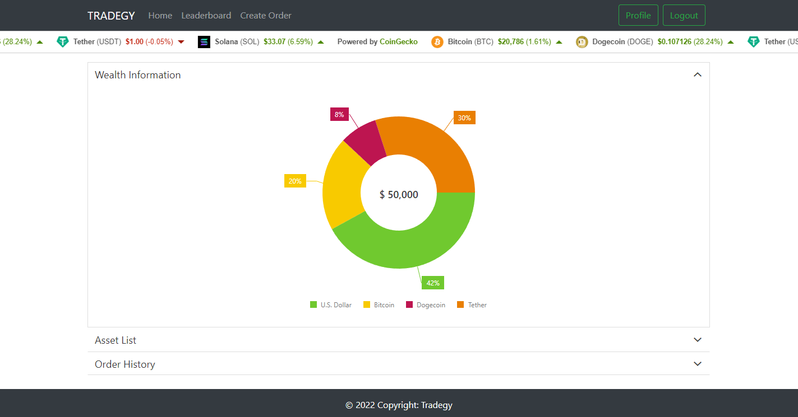
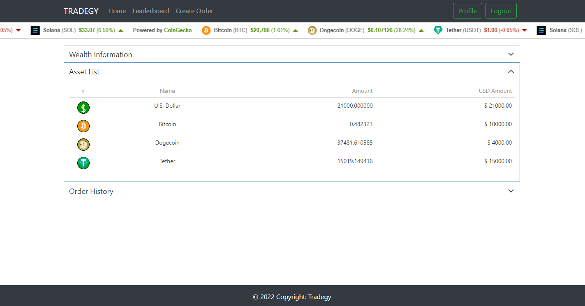
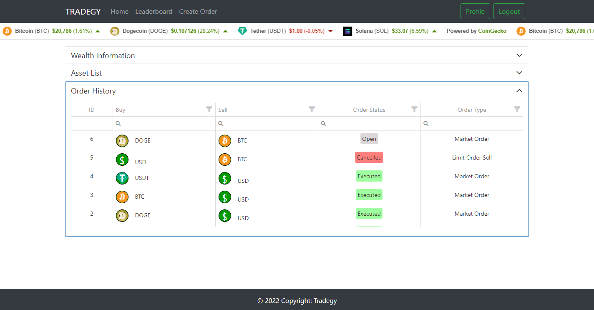
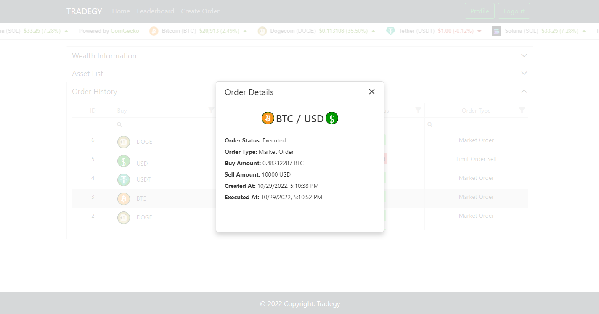
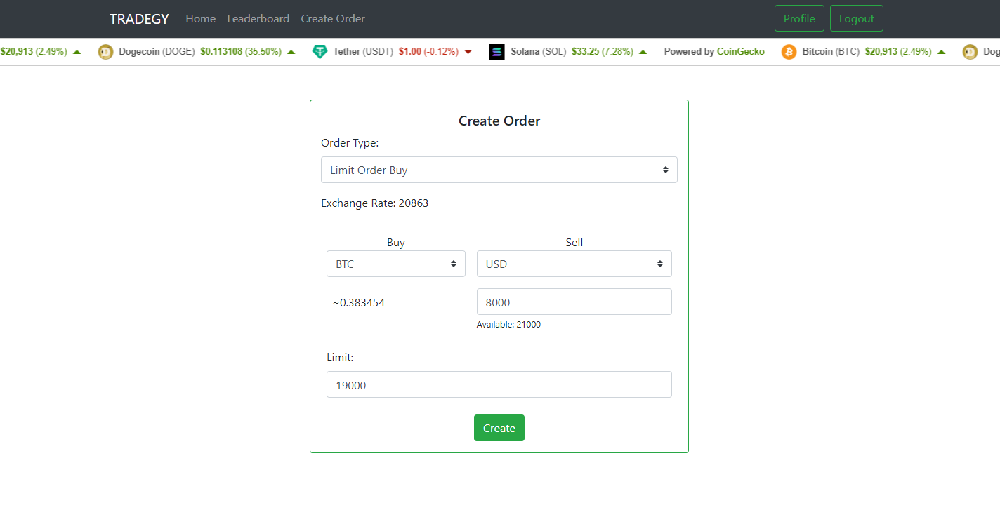
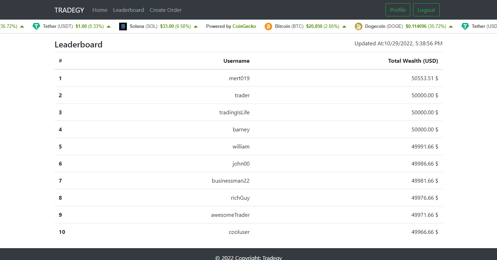

[](https://opensource.org/licenses/MIT)

# Tradegy


Tradegy is a mock trading platform. \
If you don't have a strategy, trading becomes tragedy.

[**Project Description**](#project-description) |
[**Screenshots**](#screenshots) |
[**Installation**](#installation) |
[**Configuration**](#configuration) |
[**Contrubuting**](#contributing)

## Project Description
Tradegy is a mock trading platform to simulate cryptocurrency trading without using real money.

## Screenshots
\
**Home Page**
\

<br>
\
**Profile Page**
\

<br>
\

<br>
\

<br>
\

<br>
\
**Create Order Page**
\

<br>
\
**Leaderboard Page**
\

<br>


## Installation
### Using Docker
```console
git clone https://github.com/mert019/tradegy
cd tradegy

# build docker images
docker build  --target tradegy-frontend . -t tradegy-frontend:latest
docker build  --target tradegy-api . -t tradegy-api:latest

# run
docker-compose up -d
```
Go to http://localhost:3000

## Configuration
Tradegy can be configured using the .env files. While running with docker, this files should given to container as volume. See example in docker-compose.yaml file.
```console
Frontend Configuration File: 
./tradegy/react-frontend/.env

API Configuration File:
./tradegy/go-backend/config/.env
```

## Contributing
Pull requests are welcome. For major changes, please open an issue first to discuss what you would like to change.
